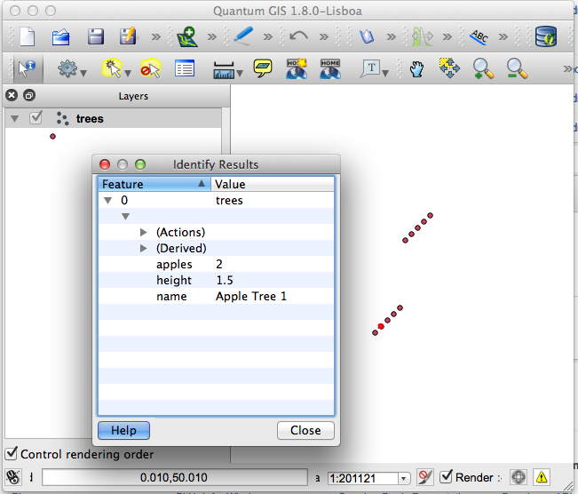

shapelib-android-demo
=====================

A crude example of making ESRI shapefiles from Android using the [Android NDK] and [Shapelib] library.  Shapelib provides the shapefile support to [GDAL/OGR] and is used by [many (most?) GIS programs][1].

Credit for the open source Shapelib/GDAL/OGR libraries goes to [Frank Warmerdam] and that community.

### Demo ###
This demo creates a trees shapefile in /sdcard/ on the android device.  The resulting shapefile opened in QGIS:



### Build the native library (only) ###
From within 'shapelib-android-demo/shapelib-android-demo' you can execute

```ndk-build clean; ndk-build```

### Build / install / run the program ###

```./shapelib-android-demo/shapelib-android-demo/$ mvn clean install android clean install android:ndk-build android:deploy```

### Execution ###
Running the activity causes the /sdcard/trees.shp (and shx, dbf) to be written.

[1]: http://trac.osgeo.org/gdal/wiki/SoftwareUsingGdal
[Android NDK]: https://developer.android.com/tools/sdk/ndk/index.html
[Frank Warmerdam]: http://home.gdal.org/~warmerda/
[GDAL/OGR]: http://www.gdal.org/
[Shapelib]: http://shapelib.maptools.org/
